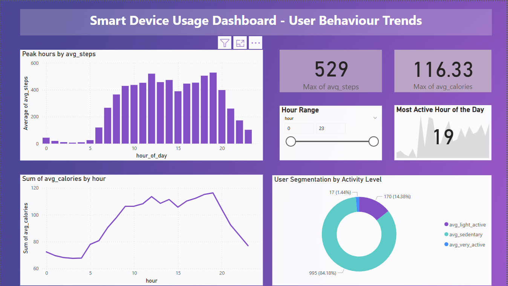

# bellabeat-powerbi-dashboard
Smart Device usage analysis with SQL and Power BI
# Smart Device Usage Dashboard

This project analyzes user activity, calorie burn, and behavioral trends based on wearable device data.

## Tools Used:
- SQL (BigQuery)
- Power BI
- DAX

## Key Insights:
- Peak activity hours: 6–8 PM
- Most users are sedentary
- Steps correlate with calories burned

## Preview:

